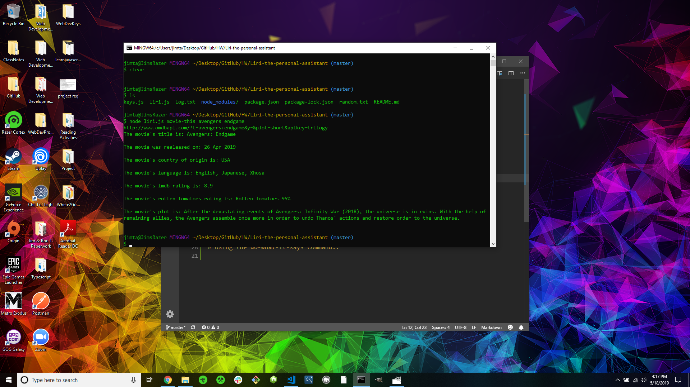
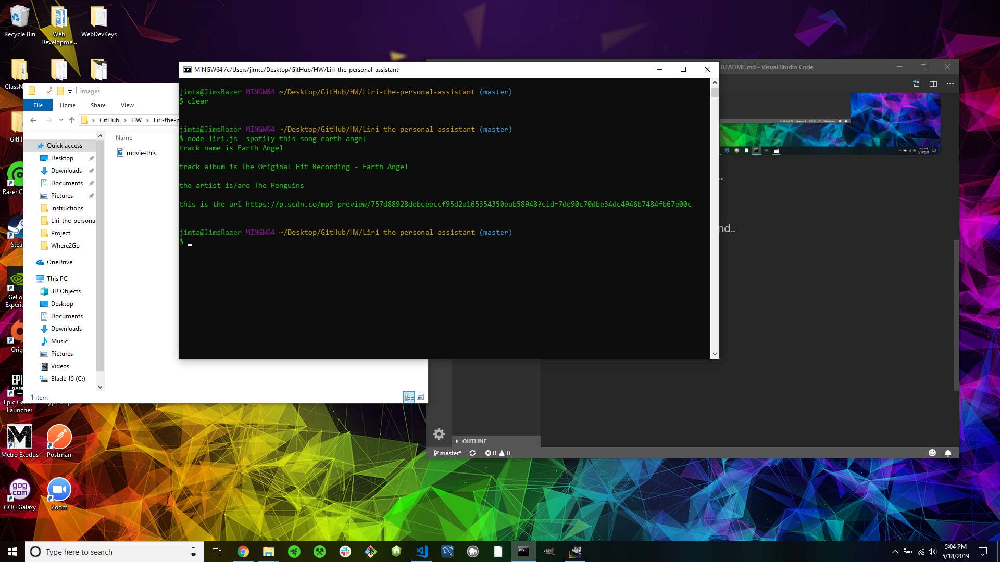
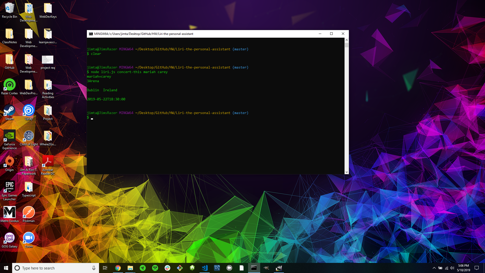
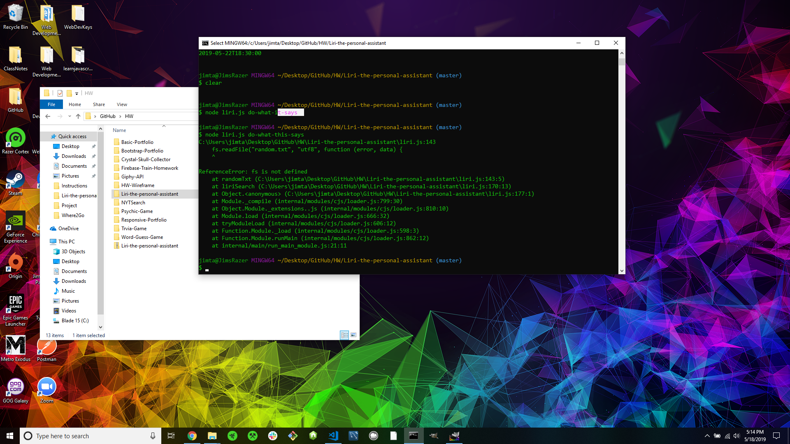

# Liri-the-personal-assistant
Using node js and multiple api's 'Liri' is the best CLI assistant around!

## Make it so liri.js can take in one of the following commands:

   * `concert-this`

   * `spotify-this-song`

   * `movie-this`

   * `do-what-it-says`

## Using movie-this command..

## Using spotify-this-song command..

## Using concert-this command..

## Using the do-what-this-says command..

